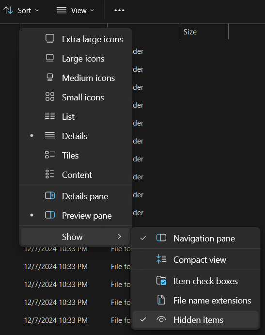
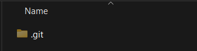

# 01-inicio-curso

## ¿Qué es Git?
Git es un sistema de control de versiones que nos permite:
- Guardar el historial de cambios
- Trabajar en equipo de manera eficiente
- Mantener diferentes versiones de nuestro proyecto
- Recuperar versiones anteriores

## Instalación y Configuración

### 1. Herramientas Necesarias
- Git: [Descarga aquí](https://git-scm.com/downloads)
- Visual Studio Code: [Descarga aquí](https://code.visualstudio.com/)

### 2. Verificar la Instalación

```console 
$ git --version
> git version 2.47.0.windows.2
```

## Vocabulario de Git

### Términos Básicos
- **Repository (Repo)**: La "carpeta especial" donde Git guarda todo tu proyecto y su historial.

- **Commit**: Una "fotografía" de tu código en un momento específico. Guarda qué cambió, quién lo cambió y por qué.

- **Branch (Rama)**: Una línea independiente de desarrollo. Como una realidad paralela de tu proyecto donde puedes hacer cambios sin afectar la versión principal.

- **Main/Master**: La rama principal de tu proyecto, donde está la versión "oficial" del código.

- **Merge**: Combinar los cambios de una rama con otra. Es como juntar dos versiones diferentes del proyecto.

- **Clone**: Hacer una copia exacta de un repositorio en tu computadora.

- **Push**: Subir tus cambios locales al repositorio remoto (ejemplo: GitHub).

- **Pull**: Traer los cambios del repositorio remoto a tu computadora.

- **Fork**: Crear una copia personal de un proyecto de alguien más en tu cuenta de GitHub.

### Términos de Estado
- **Modified**: Archivos que han sido modificados pero aún no están preparados para un commit.

- **Staged**: Cambios marcados para ser incluidos en el próximo commit.

- **Committed**: Cambios que ya han sido guardados en el historial de Git.

### Términos Avanzados
- **Stash**: Guardar temporalmente cambios que no estás listo para commitear.

- **Rebase**: Reorganizar commits para tener un historial más limpio.

- **Tag**: Una marca especial para señalar versiones importantes del proyecto (ejemplo: v1.0).

- **Head**: Indica en qué commit estás trabajando actualmente.

- **Origin**: El nombre por defecto del repositorio remoto principal.

### Términos de Conflictos
- **Merge Conflict**: Cuando Git no puede combinar automáticamente dos versiones diferentes del mismo archivo.

- **Remote**: Un repositorio almacenado en Internet (como en GitHub).

- **Local**: La versión del repositorio en tu computadora.

---

# La Carpeta .git - El Corazón del Repositorio

Git guarda todo el historial y configuración de nuestro repositorio en una carpeta oculta llamada `.git`. Esta carpeta es crucial:

1. Ubicación de la carpeta `.git`:



*Para ver la carpeta .git, necesitas habilitar "Mostrar archivos ocultos" en tu explorador*

2. La carpeta `.git` en nuestro repositorio:



*Esta carpeta contiene todo el historial y configuración de nuestro repositorio*

⚠️ **¡IMPORTANTE!**: Nunca borres la carpeta `.git`. Si la eliminas:
- Perderás todo el historial de cambios
- Tu carpeta dejará de ser un repositorio Git
- No podrás hacer commits ni pushes
- Perderás la conexión con el repositorio remoto

## Git vs GitHub - ¿Cuál es la diferencia?

Es común confundir Git con GitHub, pero son cosas diferentes que se complementan:

**Git**:
- Es el sistema de control de versiones
- Se instala en tu computadora
- Funciona localmente
- Es como el "motor" que gestiona tus versiones
- Es gratuito y de código abierto

**GitHub**:
- Es una plataforma web que usa Git
- Almacena tus repositorios en la nube
- Permite colaborar con otros desarrolladores
- Añade funciones sociales y de colaboración
- Es como la "red social" del código
- Ofrece servicios gratuitos y de pago

**Cómo se complementan**:
1. Git maneja tus versiones localmente
2. GitHub guarda una copia en la nube
3. Puedes sincronizar ambos cuando quieras
4. GitHub añade herramientas de colaboración

### Flujo Básico de Trabajo

- Haces cambios en tus archivos
- Git detecta qué archivos cambiaron
- Tú eliges qué cambios guardar
- Creas un commit con esos cambios
- ¡Git guarda la nueva versión!


Invitacón: [Discord](https://discord.com/invite/pBjEVYTC7t)